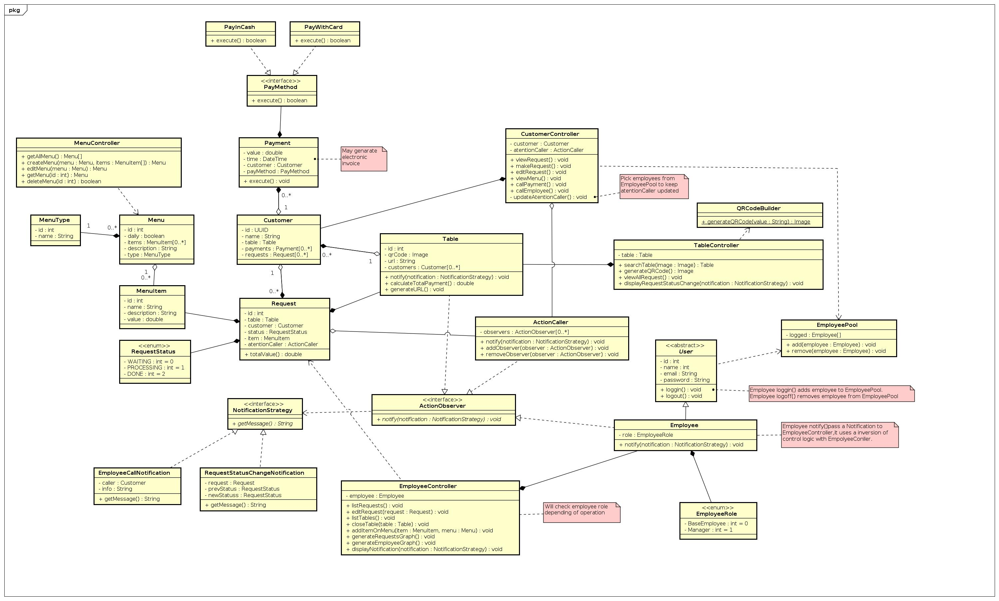

# Diagrama de classes

## Histórico de Versão

<table>
  <thead>
    <tr>
      <th>Data</th>
      <th>Autor(es)</th>
      <th>Descrição</th>
      <th>Versão</th>  
    </tr>
  </thead>

  <tbody>
    <tr>
      <td>24/09/2020</td>
      <td>
        Lucas Midlhey(<a target="blank" href="https://github.com/lucasmidlhey">Lucas Midlhey</a>),
         
        Fábio Teixeira(<a target="blank" href="https://github.com/fabio1079">fabio1079</a>)
      </td>
      <td>Criação do documento</td>
      <td>0.1</td>
    </tr>
    <tr>
      <td>25/09/2020</td>
      <td>
        Fábio Teixeira(<a target="blank" href="https://github.com/fabio1079">fabio1079</a>)
      </td>
      <td>Adiciona QRController e QRCodeBuilder</td>
      <td>0.2</td>
    </tr>
    <tr>
      <td>26/09/2020</td>
      <td>
        Fábio Teixeira(<a target="blank" href="https://github.com/fabio1079">fabio1079</a>)
      </td>
      <td>
        1 - Muda linguagem para o inglês 
        2 - Adiciona EmployeeController e CustomerController 
        3 - Muda QRController para TableConroller 
        4 - Adiciona observer design pattern para notificar funcionário quando o cliente está chamando
      </td>
      <td>0.3</td>
    </tr>
    <tr>
      <td>27/09/2020</td>
      <td>
        Fábio Teixeira(<a target="blank" href="https://github.com/fabio1079">fabio1079</a>)
      </td>
      <td>
        1 - Adiciona observer para notificar mesa em mudanças no status dos pedidos 
        2 - Adiciona estratégia no sistema de notificações funcionando em conjunto com o observer, facilitando extensão 
        3 - Adiciona observações
      </td>
      <td>0.4</td>
    </tr>
    <tr>
      <td>28/09/2020</td>
      <td>
        Fábio Teixeira(<a target="blank" href="https://github.com/fabio1079">fabio1079</a>)
      </td>
      <td>
        1 - Atualiza diagrama para ficar de acordo com feat 04 dos diagramas de sequência: 
        Adiciona MenuController, MenuType, atributo daily em menu.
      </td>
      <td>0.5</td>
    </tr>
    <tr>
      <td>28/09/2020</td>
      <td>
        Fábio Teixeira(<a target="blank" href="https://github.com/fabio1079">fabio1079</a>)
      </td>
      <td>
        1 - Atualiza diagrama para ficar de acordo com feat 05 dos diagramas de sequência: 
        Adiciona EmployeePool, adiciona método updateAtentionCaller em CustomerController
      </td>
      <td>0.6</td>
    </tr>
  </tbody>
</table>

## Diagrama

### Versão atual

#### Observações

- Métodos getters e setters nao estão sendo mostrados no diagrama para evitar poluição visual, mas considera-se que todo atributo privado tem o seu respectivo getter e setter.
- Até a versão 03 estava sendo usado no Lucidchart, porém, devido a limitação do número de elementos que a versão livre deste permite, uma migração do diagrama para o Astah foi realizada.
- O sistema de notificações foi pensado para ser extensível, bastando implementar uma estratégia sempre que necessário.
- uso de observers:
  - Quando um cliente chama por um funcionário, ver [feat 05: Customer, calls employee](diagrama_sequencia.md)
  - Quando um funcionário muda o status de um pedido, ver [feat 06: notify request status](diagrama_sequencia.md)
- ActionCaller está sendo relacionada como uma agregação, já que considera-se que não há necessidade de sempre instanciala. Ex: Se um cliente nunca chamar por um funcionário, não tem por que sempre instanciar uma ActionCaller na CustomerController.

## Versões anteriores

- [Versão 05](https://ibb.co/TWNMH35)
- [Versão 04](https://ibb.co/9gNWVgF)
- [Versão 03](https://ibb.co/JkrCHvc)
- [Versão 02](https://ibb.co/gP8WzxT)
- [Versão 01](https://ibb.co/5jqPWw9)
