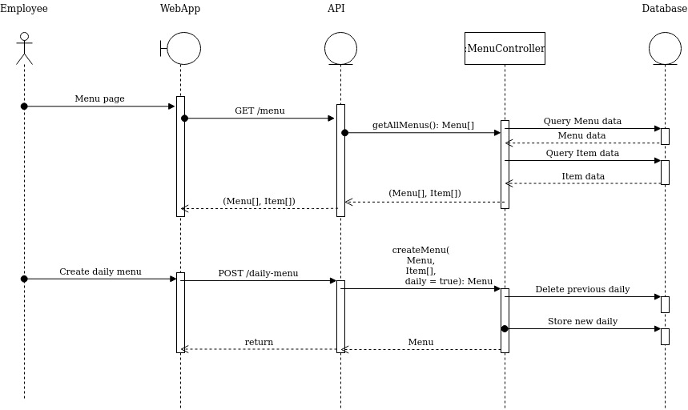

# Diagrama de sequência

## Histórico de Versão

<table>
  <thead>
    <tr>
      <th>Data</th>
      <th>Autor(es)</th>
      <th>Descrição</th>
      <th>Versão</th>  
    </tr>
  </thead>

  <tbody>
    <tr>
      <td>25/09/2020</td>
      <td>
        Fábio Teixeira(<a target="blank" href="https://github.com/fabio1079">fabio1079</a>)
      </td>
      <td>Criação do documento</td>
      <td>0.1</td>
    </tr>
    <tr>
      <td>27/09/2020</td>
      <td>
        Fábio Teixeira(<a target="blank" href="https://github.com/fabio1079">fabio1079</a>)
      </td>
      <td>Atualiza diagrama feat 01 para versão 03 do diagrama de classes</td>
      <td>0.2</td>
    </tr>
    <tr>
      <td>28/09/2020</td>
      <td>
        Fábio Teixeira(<a target="blank" href="https://github.com/fabio1079">fabio1079</a>)
      </td>
      <td>Adiciona diagrama feat 04</td>
      <td>0.3</td>
    </tr>
  </tbody>
</table>

## Introdução

Diagramas de sequência referentes as features do [backlog](../../base/backlog_produtov2.md)

## Diagramas

### Feat 01: QR Code

#### Employee, generates QR Code

#### Customer, read QR Code

#### Versões anteriores

- [Versão 01](https://ibb.co/j8cg9tn)

### Feat 04:  Manter cardápio

#### Employee, creates daily menu

#### Customer, read menu

#### Observações

- Só pode haver um cardaṕio do dia, logo quando um novo é criado, o anterior é deletado.
- <strong>TODO:</strong> É um manter, então tem que modelar o resto do CRUD. <small>É um crud... preciso mesmo modelar ele todo? 😭...é um CRUD...UM CRUD !!!😑</small>

