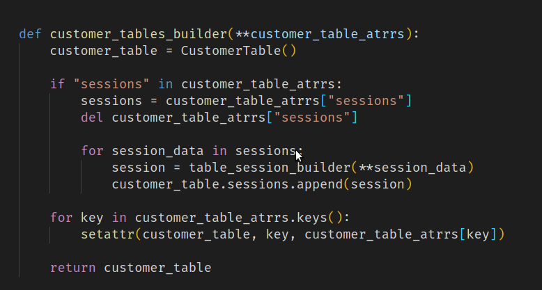
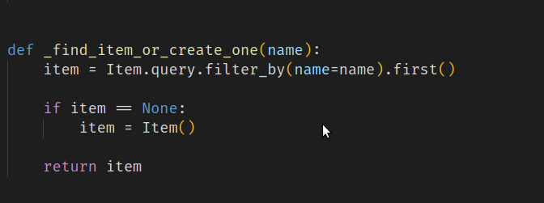
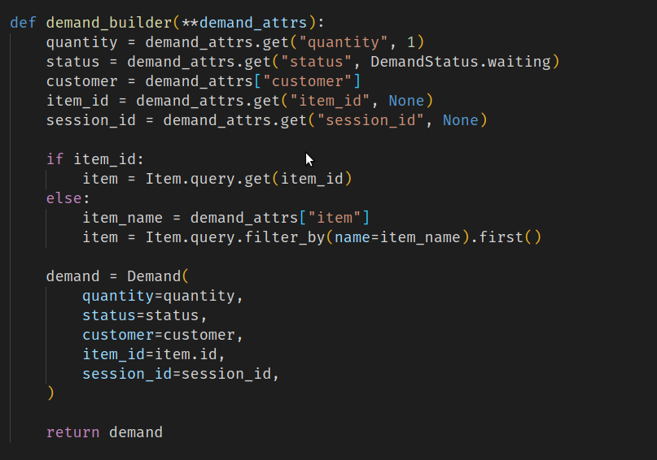
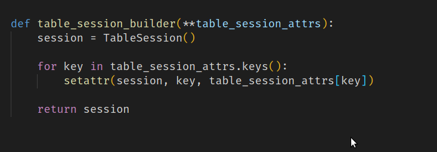
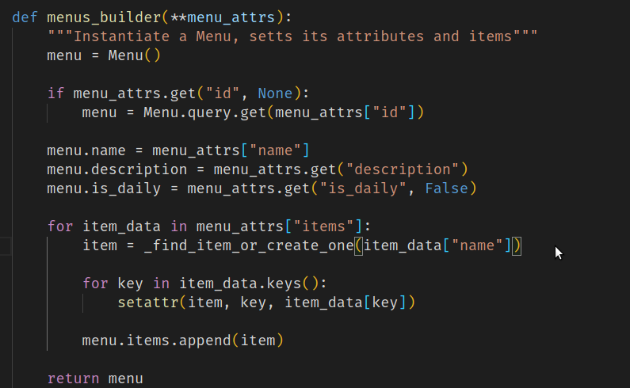
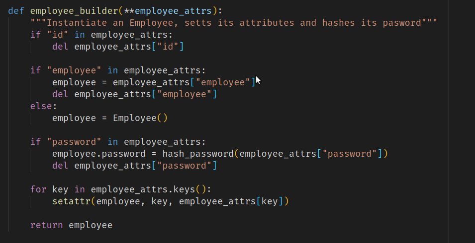

# Reutilização

## Histórico de Versão

<table>
  <thead>
    <tr>
      <th>Data</th>
      <th>Autor(es)</th>
      <th>Descrição</th>
      <th>Versão</th>  
    </tr>
  </thead>

  <tbody>
    <tr>
      <td>19/11/2020</td>
      <td>
        Caio César Beleza(<a target="blank" href="https://github.com/Caiocbeleza">Caiocbeleza</a>)
      </td>
      <td>Adicionando Introdução de reutilização de software</td>
      <td>0.1</td>
    </tr>
    <tr>
      <td>19/11/2020</td>
      <td>
        Joao Pedro(<a target="blank" href="https://github.com/Caiocbeleza">jppgomes</a>)
      </td>
      <td>Adicionando exemplo de reutilização</td>
      <td>0.2</td>
    </tr>
    <tr>
      <td>19/11/2020</td>
      <td>
        Caio César Beleza(<a target="blank" href="https://github.com/Caiocbeleza">Caiocbeleza</a>)
      </td>
      <td>Começando o tópico de reutilização a nivel de arquitetura</td>
      <td>0.3</td>
    </tr>
    <tr>
      <td>20/11/2020</td>
      <td>
        Lucas Midlhey(<a target="blank" href="https://github.com/lucasmidlhey">lucasmidlhey</a>)
      </td>
      <td>Reutilização do builder por tópicos</td>
      <td>0.4</td>
    </tr>
  </tbody>
</table>

## Introdução

&emsp;
A reutilização de software é baseada na utilização de conceitos, produtos ou soluções previamente elaboradas para a criação de um novo software. Podem ser reutilizadas, de um sistema já desenvolvido, partes como especificações, arquitetura e código fonte. A reutilização ajudar a reduzir o tempo de desenvolvimento de um novo software e, consequentemente os custos. Por isso, no cenário atual de desenvolvimento ágil de software, é um conceito interessante.

&emsp;
Portanto, os tópicos a seguir descrevem as partes reutilizáveis do projeto QRodízio, que foram feitas com o objetivo de facilitar tanto a manutenção do sistema, quanto o potencial de evolução dele.

## Arquitetura

&emsp;
Como no projeto foi empregada uma arquitetura adaptada do MVC e foi divido em Back-end e Front-end, com tecnologias separadas, a reutilização dele fica bastante simples e eficiente.

&emsp;
A API independente pode ser consumida facilmente por outros templates, o que possibilita a conexão com vários dispositivos(mobile, outros front-end web, etc.).

## Código

<ul>
<li>

[Style.css](https://github.com/UnBArqDsw/2020.1_G10_QRodizio_Frontend/blob/tables-and-qrcodes/src/assets/styles/styles.css) : O arquivo que contém os estilos utilizados no projeto. É um bom exemplo de reutilização, pois cada estilo definido pode ser acessado e aplicado em vários elementos do sistema, o que diminui repetições e facilita a mudança de estilo dos elementos, já que podem ser mudados vários elementos de uma vez, ao invés de ter que mudar de um por um.

</li>

<li>

[builders.py](https://github.com/UnBArqDsw/2020.1_G10_QRodizio_Backend/blob/develop/qrodizio/builders.py) : Este exemplo onde é utilizado o padrão builder ilustra como você pode reutilizar o mesmo código de construção de objeto. Nela temos vários construtores que fazem as models em especialmente útil qando precisa criar um objeto com muitas opções possíveis de configuração.

<ul>
<li>
   customer_tables_builder: cria diferentes representações para sessions neste caso dentro da Costumer_table e de sessions.

</li>
<li>

\_find_item_or_create_one: Simplesmete procura um item se nao encontrar ela cria. Foi feita para nao haver redundâncias nos items de cardápio.

</li>
<li>

demand_builder: Podemos ver que define seus atributos, algum por padrão, e retorna e forma de demand, utilizada tanto para clientes quanto para empregados.

</li>
<li>

table_session_builder: busca uma sessão na tabela de sessões e define a partir de uma chave que é feita através do QRcode.

</li>
<li>

menus_builder: Neste builder ele instancia a classe Menu definindo os atributos de item.

</li>
<li>

employee_builder: Neste Builder instancia a classe de empregados defindo seus atributos e um padrão de hash para a senha

</li>
</ul>
</li>

</ul>

## Referências

<ul>
<li>

DEVMEDIA. Reutilização de Software - Revista Engenharia de Software Magazine 39. Disponível em: https://www.devmedia.com.br/reutilizacao-de-software-revista-engenharia-de-software-magazine-39/21956. Acesso em: 19 de novembro. 2020.

</li>
</ul>
