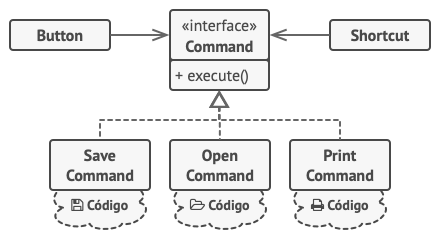

## Histórico de Versão

<table>
  <thead>
    <tr>
      <th>Data</th>
      <th>Autor(es)</th>
      <th>Descrição</th>
      <th>Versão</th>
    </tr>
  </thead>

  <tbody>
    <tr>
      <td>26/10/2020</td>
      <td>
        Lucas Midlhey(<a target="blank" href="https://github.com/lucasmidlhey">lucasmidlhey</a>)
      </td>
      <td>Noçoes e introdução ao command</td>
      <td>0.2</td>
    </tr>
  </tbody>
</table>
O Command é um padrão de projeto comportamental que transforma um pedido em um objeto independente, de uma forma mais clara que permite que métodos de diferentes pedidos se alinhem em fila podendo atrasar e suportar operações feitas.
quando se tem uma classe e nela possuem inúmeras subclasses para ser herdadas podem ocorrer problemas no código que quebrem alguma etapa ou método que também utilize tornando uma total dependência da classe primária. O padrão Command supre esse problema pois ele consegue que os métodos não enviem esse pedido diretamente, muito pelo contrario, ele detalha o pedido com o objeto a ser chamado, nome do método e a lista de argumentos em uma classe separada que tem apenas um método dentro desse pedido.

Na figura abaixo temos um exemplo, onde a classe command existem alguns métodos que não necessariamente precisa implementar vários comportamentos de cliques. É suficiente colocar apenas um campo na classe botão base que armazena a referencia para um objeto comando e faz o botão executar aquele comando com um clique

### Aplicabilidade

- Utilizando o padrão Command quando necessário em uma operação em fila podendo agendar sua execução ou podendo executa-la remotamente
- Quando necessário parametrizar objetos com operações
- Quando necessario implementar operações reversíveis
