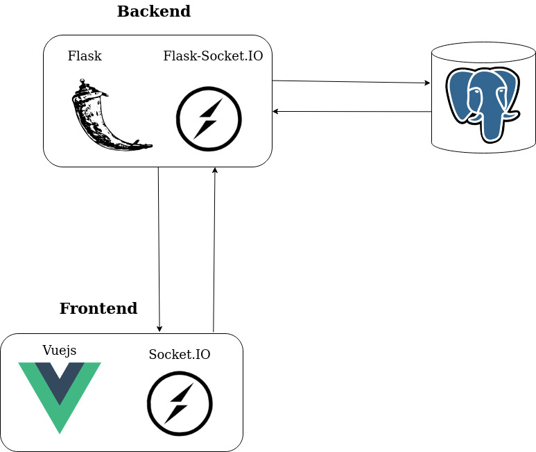

# Documento de Arquitetura

## Histórico de Revisão

<table>
<thead>
<tr>
<th>Data</th>
<th>Autor(es)</th>
<th>Descrição</th>
<th>Versão</th>
</tr>
</thead>
<tbody>
<tr>
<td>02/10/20</td>
<td>
Fábio Teixeira(<a  target="blank"  href="https://github.com/fabio1079">fabio1079</a>)
</td>
<td>Criação do documento</td>
<td>0.1</td>
</tr>
<tr>
<td>05/11/20</td>
<td>
Lucas Midlhey(<a  target="blank"  href="https://github.com/lucasmidlhey">lucasmidlhey</a>)
</td>
<td>Visão geral, Visão lógica, diagram de pacotes</td>
<td>0.2</td>
</tr>
<tr>
  <td>10/11/2020</td>
  <td>
    Caio César Beleza(<a target="blank" href="https://github.com/Caiocbeleza">Caiocbeleza</a>)
  </td>
  <td>Adicionando Visão de Processos</td>
  <td>0.3</td>
</tr>
</tbody>
</table>

## 1. Introdução

### 1.1 Objetivo

Este documento tem como objetivo esboçar uma visão ampla da arquitetura do QRodízio e informando as decisões significativas que foram tomadas em relação ao sistema do ponto de vista do arquiteto, desde o escopo até a visão lógica.

### 1.2 Escopo

O QRodízio visa ser uma ferramenta que auxilia no gerenciamento de mesas de rodízio e acesso a pedidos.

### 1.3 Definições, Acrônimos e Abreviações

### 1.4 Referências

- What is Vue.js? Em: vuejs.org. Disponível em: [https://vuejs.org/v2/guide/](https://vuejs.org/v2/guide/). Acesso em: 2 de outubro de 2020.

- Flask (framework web). In: WIKIPÉDIA: a enciclopédia livre. Disponível em: [https://pt.wikipedia.org/wiki/Flask\_(framework_web)](<https://pt.wikipedia.org/wiki/Flask_(framework_web)>). Acesso em: 2 de outubro de 2020.

- Socket.IO. Em: WIKIPÉDIA: a enciclopédia livre. Disponível em: [https://en.wikipedia.org/wiki/Socket.IO)](https://en.wikipedia.org/wiki/Socket.IO). Acesso em: 2 de outubro de 2020.

- O que é Vuex? Em: vuex.vuejs.org. Disponível em: [https://vuex.vuejs.org/ptbr/](https://vuex.vuejs.org/ptbr/). Acesso em: 2 de outubro de 2020.

- Diretriz: Visão Arquitetural. Disponível em: https://www.trt9.jus.br/pds/v1-1/pdstrt9/guidances/guidelines/architectural_view_FF6EDA37.html#:~:text=Vis%C3%A3o%20de%20Processo%3A%20Descreve%20como,de%20tempo%2Dde%2Dexecu%C3%A7%C3%A3o.&text=Vis%C3%A3o%20de%20Implanta%C3%A7%C3%A3o%3A%20Descreve%20como,uso%20das%20Vis%C3%B5es%204%2B1. Acesso em: 10 de novembro. 2020.

- Visões Arquiteturais. Disponível em: http://www.inf.ufpr.br/andrey/ci163/VisoesAl.pdf. Acesso em: 10 de novembro. 2020.

### 1.5 Visão Geral

Neste documento traremos alguns pontos que elucidam melhor a arquitetura do projeto detalhando suas representações e casos. Iremos abordar representação da arquitetura, objetivos e restrições, visão caso de uso, lógica, processos e implantação, qualidade, tamanho e desempenho.

## 2. Representação da Arquitetura

### 2.1 Tecnologias utilizadas

#### Vuejs

Web framework progressivo para construção de interfaces de usuário. Vue foi desenhado para ser de fácil utilização e incrementalmente adicionável a qualquer projeto. O foco do Vue está na camada de visualização e criação de single page applications.

#### Flask

Flask é um pequeno framework web escrito em Python e baseado na biblioteca WSGI Werkzeug e na biblioteca de Jinja2. Flask está disponível sob os termos da Licença BSD.

#### Socket.IO

Socket.IO é uma biblioteca JavaScript para aplicativos da web em tempo real. Permite comunicação bidirecional em tempo real entre clientes e servidores da Web. Ele tem duas partes: uma biblioteca do lado do cliente que é executada no navegador e uma biblioteca do lado do servidor para o Node.js.

#### Vuex

O Vuex é um padrão de gerenciamento de estado + biblioteca para aplicativos Vue.js. Ele serve como um store centralizado para todos os componentes em uma aplicação, com regras garantindo que o estado só possa ser mutado de forma previsível.

### 2.1 Representação arquitetural

#### Visão geral

#### Vuex

## 3. Objetivos e Restrições de Arquitetura

A aplicação deverá ser suportada pelos navegadores, Mozilla Firefox, Google Chrome e Microsoft Edge. Toda parte do frontend será construída utilizando Vuejs, biblioteca de JavaScript para criar interfaces para o usuário, juntamente com Vuex para o gerenciamento de stado da aplicação pelo lado do usuário. A aplicação também utilizará do microframework Flask, que é construído em python e que juntamente com a biblioteca Socket.IO/Flask-Socket.IO fará a comunicação em tempo real entre usuário e servidor.

Para facilitar no desenvolvimento a ferramenta Docker será utilizada garantindo que todos no desenvolvimento estão utilizando o mesmo ambiente e configurações.

## 4. Casos de Uso

O diagrama de casos de uso auxiliam a comunicação entre os papéis dentro do software apresentando as principais funcionalidades focando no cliente, descrevendo cenários de interação entre as partes internas e externas do sistema com foco no usuário.

Nossos casos de uso foram criados no inicio do projeto para auxiliar o levantamento de requisitos.

[Visão atual ](https://unbarqdsw.github.io/2020.1_G10_QRodizio/modelagem/diagramas_dinamicos/diagrama_casos_de_uso.html#versoes-2-0)

[Rastreabilidade](https://unbarqdsw.github.io/2020.1_G10_QRodizio/modelagem/diagramas_dinamicos/diagrama_casos_de_uso.html#versoes-2-0)

## 5. Visão lógica

Descrevemos como o sistema é estruturado, em termos de unidades de implementação. Os elementos são pacotes, classes e interfaces. O relacionamento entre os elementos mostra as dependências, as realizações de interface, os relacionamentos parte-todo e assim por diante.

### 5.1 Visão de pacotes

Muito utilizado para ilustrar a arquitetura de um sistema mostrando o agrupamento de suas classes dividindo entre pedaços do sistema lógico e dependência entre eles.

[diagrama de pacotes](https://unbarqdsw.github.io/2020.1_G10_QRodizio/modelagem/diagramas_estaticos/diagramas_pacote.html#versoes-1-0)

## 6. Visão de processos

A visão de processos ilustra a interação e os comportamentos de um conjuto de elementos em tempo-de-execução(Processos, threads, atividades, etc.) e mostra como se dá a comunicação e a concorrência dessas threads. A visão dos processos empregados no projeto, que ilustram os principais fluxos de comunicações do sistema, podem ser encontradas nos seguintes documentos:

[Diagamas de Sequência](https://github.com/UnBArqDsw/2020.1_G10_QRodizio/blob/master/docs/modelagem/diagramas_dinamicos/diagrama_sequencia.md)

[Diagramas de Atividade](https://github.com/UnBArqDsw/2020.1_G10_QRodizio/blob/master/docs/modelagem/diagramas_dinamicos/diagramas_atividade.md)

## 7. Visão de implantação

## 8. Tamanho e Desempenho

## 9. Qualidade
