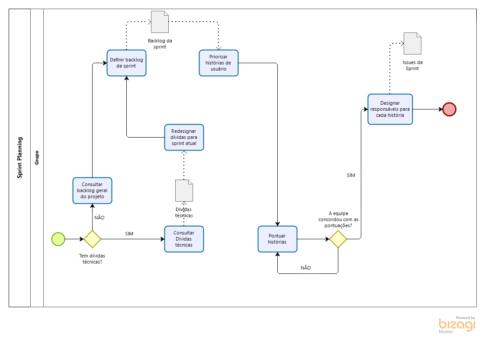

# Modelagem BPMN

## Histórico de versão

<table>
  <thead>
    <tr>
      <th>Data</th>
           <th>Autor(es)</th>
      <th>Descrição</th>
      <th>Versão</th>
    </tr>
  </thead>
  <tbody>
    <tr>
      <td>09/09/2020</td>
      <td>Caio César Beleza(<a target="blank" href="https://github.com/Caiocbeleza">Caiocbeleza</a>)</td>
      <td>Adicionando Introdução de Modelagem BPMN</td>
      <td>
        0.1
      </td>
    </tr>
    <tr>
      <td>10/09/2020</td>
      <td>Caio César Beleza(<a target="blank" href="https://github.com/Caiocbeleza">Caiocbeleza</a>)</td>
      <td>Adicionando Diagrama BPMN da escolha do tema</td>
      <td>
        0.2
      </td>
    </tr>
    <tr>
      <td>10/09/2020</td>
      <td>Caio César Beleza(<a target="blank" href="https://github.com/Caiocbeleza">Caiocbeleza</a>)</td>
      <td>Adicionando Diagrama BPMN de Sprint Planning</td>
      <td>
        0.3
      </td>
    </tr>
    <tr>
      <td>10/09/2020</td>
      <td>Caio César Beleza(<a target="blank" href="https://github.com/Caiocbeleza">Caiocbeleza</a>)</td>
      <td>Adicionando Diagrama BPMN de Sprint Review</td>
      <td>
        0.4
      </td>
    </tr>
     <tr>
      <td>10/09/2020</td>
      <td>Lucas Midlhey<a target="blank" href="https://github.com/lucasmidlhey">(lucasmidlhey</a>)</td>
      <td>Adicionando Diagrama BPMN escopo e metodologia</td>
      <td>
        0.5
      </td>
   <tr>
      <td>10/09/2020</td>
      <td>Joao Pedro<a target="blank" href="https://github.com/jppgomes">(jppgomes</a>)</td>
      <td>Adicionando Diagrama BPMN escopo e metodologia</td>
      <td>
        0.6
      </td>
    </tr>
  </tbody>
</table>

## Introdução

&emsp;
BPMN(Business Process Model and Notation) é uma notação que permite uma ilustração de processos, especificando-os em diagramas que sejam fácies de ler. Isso é feito através da simbologia BPMN, que serve como uma linguagem padrão para essa notação.

&emsp;
O que a linguagem BPMN faz é representar cada ação como um símbolo. São utilizado quatro tipos de símbolo: 
<ul>
<li>Objetos de fluxo;</li>
<li> Objetos de conexão;</li>
<li> Swim Lanes;</li>
<li>Artefatos.</li>  
</ul>

&emsp;
Existem 3 tipos de objetos de fluxo:
<ul>
<li>Atividades: Que representão os trabalhos a serem feitos(sempre são ações), simbolizados por quadrados</li>
<li>Eventos: Que simbolizam ocorrências no processo, simbolizados por círculos</li>
<li>Gateways: Pontos Condicionais, que determinam o para qual direção o processo irá seguir, simbolizados por diamantes</li>
</ul>

&emsp;
Os tipos de swim lanes são 2:
<ul>
<li>Piscinas(Pools): São os processos contidos em um processo</li>
<li>Raias(Lanes): Cada piscina possui raias, que simbolizam papéis, áreas e responsabilidades no processo.</li>
</ul>

&emsp;
Os seguintes são fluxos de conexão:
<ul>
<li>Fluxo de sequência: Que mostra a ordem das atividades, simbolizadas por uma linha preta cheia com uma seta</li>
<li>Fluxo de mensagens: Indica mensagens entre processos/piscinas, simbolizado por uma linha tracejada, com um círculo aberto numa extremidade e uma seta aberta na outra.</li>
<li>Associação: Conceta os artefatos aos objetos de fluxo, simbolizado por uma linha tracejada.</li>
</ul>

&emsp;
Artefatos são os objetos de dados, que podem ser saída, entrada, armazenamento de dados e objetos de dados.

&emsp;
Nós utilizaremos a modelagem BPMN para conseguirmos mapear, de forma que seja de fácil entendimento para todos, os fluxos dos processos que serão implementados durante o projeto.

## Versões 1.0

### Processo de Escolha do Tema do Projeto

### Autor: [Caio](https://github.com/Caiocbeleza)

### Definição de metodologia

### Autor: [Lucas](https://github.com/lucasmidlhey)

### Processo de Sprint Planning

### Autor: [Caio](https://github.com/Caiocbeleza)

### Processo de Sprint Review

### Autor: [Caio](https://github.com/Caiocbeleza)

### Definição de escopo

### Autor: [Lucas](https://github.com/lucasmidlhey)

### Definição de escopo

### Autor: [Joao Pedro](https://github.com/jppgomes)

## Referências
<ul>
<li>
HEFLO. Notação BPMN, a mais usada para modelar processos. Disponível em https://www.heflo.com/pt-br/bpm/notacao-bpmn/ . Acesso em: 09 de setembro. 2020.
</li>
</ul>
