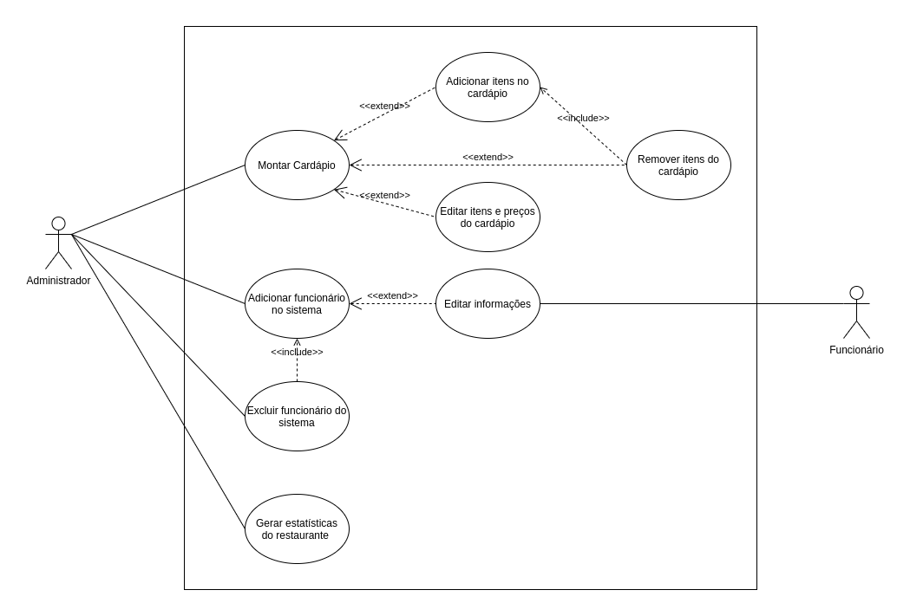

## Casos de Uso
## Histórico de Versão

<table>
  <thead>
    <tr>
      <th>Data</th>
      <th>Autor(es)</th>
      <th>Descrição</th>
      <th>Versão</th>
    </tr>
  </thead>

  <tbody>
    <tr>
      <td>28/09/2020</td>
      <td>
        Caio César Beleza(<a target="blank" href="https://github.com/Caiocbeleza">Caiocbeleza</a>)
      </td>
      <td>Adicionando introdução de diagrama de casos de uso </td>
      <td>0.1</td>
    </tr>
    <tr>
      <td>28/09/2020</td>
      <td>
        Caio César Beleza(<a target="blank" href="https://github.com/Caiocbeleza">Caiocbeleza</a>)
      </td>
      <td>Adicionando diagrama de casos de uso do cliente</td>
      <td>0.2</td>
    </tr>
    <tr>
      <td>28/09/2020</td>
      <td>
        Caio César Beleza(<a target="blank" href="https://github.com/Caiocbeleza">Caiocbeleza</a>)
      </td>
      <td>Adicionando diagrama de casos de uso do administrador</td>
      <td>0.3</td>
    </tr>
  </tbody>
</table>

## Introdução

&emsp;
O diagrama de casos de uso mostra as formas de interações dos usuários com o sistema, utilizando um conjunto de símbolos e conectores especializados.

&emsp;
Esse diagrama contém as seguintes notações:

&emsp;
Atores: Representa uma pessoa ou sistema

&emsp;
Casos de uso: Representa uma funcionalidade do sistema.

&emsp;
Relacionamentos: Interação entre os atores e os casos de uso.
<ul>
<li>
Relacionamento de comunicação ou associação: Representa a interação entre um ator e um caso de uso.
</li>
<li>
Relacionamento de Inclusão: Utilizado quando um comportamento se repete em mais de um caso de uso.
</li>
<li>
Relacionamento de extensão: Utilizado quando existem casos alternativos derivados de um outro caso de uso.
</li>
<li>
Relacionamento de herança: Relacionamento entre atores, utilizado para representar uma generalização.
</li>
</ul>

## Versões 1.0

### Autor: [Caio](https://github.com/Caiocbeleza)

### Autor: [Caio](https://github.com/Caiocbeleza)

## Referências
<ul>
<li>
MEDIUM. UML — Diagrama de Casos de Uso. Disponível em: https://medium.com/operacionalti/uml-diagrama-de-casos-de-uso-29f4358ce4d5 . Acesso em: 28 de setembro. 2020.
</li>
<li>
LUCIDCHART.
Diagrama de caso de uso UML: O que é, como fazer e exemplos. Disponível em: https://www.lucidchart.com/pages/pt/diagrama-de-caso-de-uso-uml . Acesso em: 28 de setembro. 2020.
</li>
<li>
DEVMEDIA. O que é UML e Diagramas de Caso de Uso: Introdução Prática à UML. Disponível em: https://www.devmedia.com.br/o-que-e-uml-e-diagramas-de-caso-de-uso-introducao-pratica-a-uml/23408 . Acesso em: 28 de setembro. 2020.
</li>
</ul>
